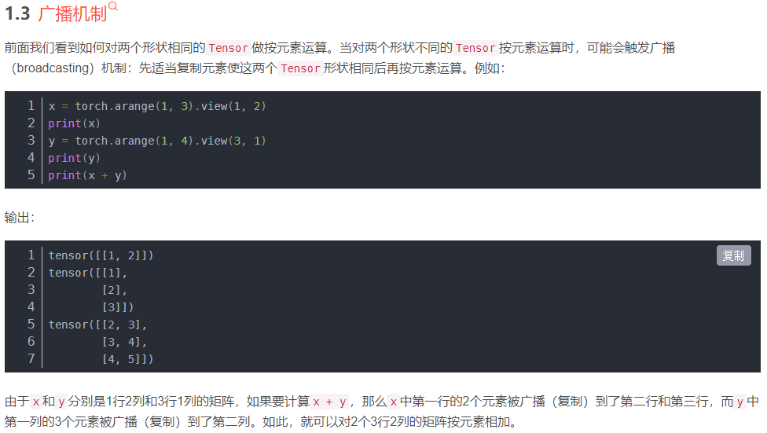
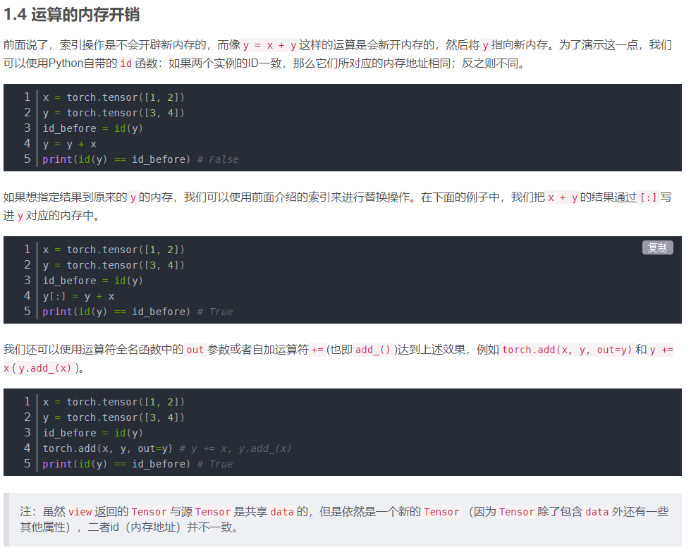
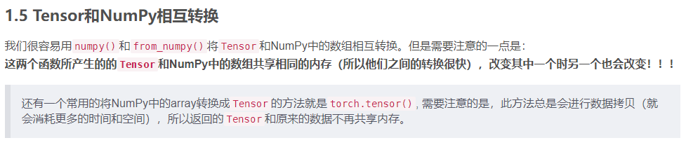

x = torch.empty(5, 3)  # 未初始化的tensor  
x = torch.rand(5, 3)   # 随机初始化的tensor  
x = torch.zeros(5, 3, dtype=torch.long)   # 全0 long型tensor  
x = torch.tensor([5, 3])  # 根据数据创建tensor  
x = x.new_ones(5, 3, dtype=torch.float64)  # 重新创建一个5*3全1 float64型tensor  
x = torch.randn_like(x, dtype=torch.float)  # 指定类型随机tensor x  
x.size()  # tensor形状  
x.shape   # tensor形状  

# 加法
y = torch.rand(5, 3)  
x + y  
result = torch.empty(5, 3)  
torch.add(x, y, out=result)  
y.add_(x)  

# 索引  改变索引数据时源数据也会跟着改变  
y = x[0, :]  
index_select(input, dim, index)	 # 在指定维度dim上选取，比如选取某些行、某些列  
masked_select(input, mask) # 例子如上，a[a>0]，使用ByteTensor进行选取  
nonzero(input) # 非0元素的下标  
gather(input, dim, index) # 根据index，在dim维度上选取数据，输出的size与index一样  

# 改变形状  
x.view(15)  
x.view(-1, 5) # -1指根据其他维度的值推出来  例如原来5,3变成3,5  
view 返回的新tensor与源tensor可能是不同size，但是共享data，改一个另一个也改  
x.clone().view() # clone后就不会改变源tensor  
使用clone还有一个好处是会被记录在计算图中，即梯度回传到副本时也会传到源Tensor。  

x = torch.randn(1)  
print(x)  
print(x.item()) # 讲一个标量tensor变成python number  
# torch提供支持一些线性代数函数，不用自己反复造轮子  

# 广播机制  
  

# 运算的内存开销  
  

# tensor与numpy相互转换  
  

